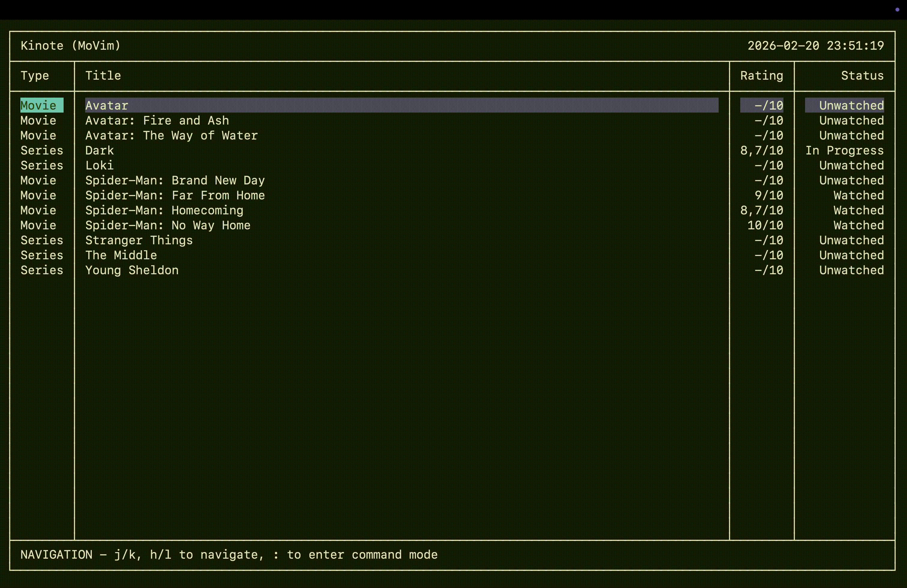

# Kinote

The movie manager originally created as the final project for EInf ("Einführung in die Informatik")
at the University of Stuttgart.

Kinote is a terminal application utilizing Vim-style keybindings and distinct operational modes for fast navigation and
management or your local movie and series library.



## Prerequisites

To run Kinote, you need a modern Java Runtime Environment (JRE) installed on your system.

- **Java 25** or higher is required to run the application. You can download it from [Adoptium](https://adoptium.net/) or any other trusted source.

You can verify your Java version by running `java --version` in your terminal.

## Getting started

1. Download the latest release from the [releases page](https://github.com/SomeSourceCode/Kinote/releases).
2. Navigate into the directory of the downloaded `jar` file.
3. Run the following command in the terminal:

   **Linux/maxOS:**
   ```bash
   java -jar Kinote.jar
   ```

   **Windows:**
   ```bash
   javaw -jar Kinote.jar
   ```

   > Note that on Windows you'll have to use `javaw` because running it directly in the Terminal usually causes
   > problems. By doing so, an emulated terminal window will be launched that allows the app to work properly.

## How does it work?

The application is a TUI (Terminal User Interface) that operates in three distinct modes.

### 1. Navigation Mode (Default)

This is the default mode used to move around and view your media library.

- <kbd>j</kbd> / <kbd>k</kbd> or <kbd>↑</kbd> / <kbd>↓</kbd>: Navigate up and down.
- <kbd>h</kbd> / <kbd>l</kbd> or <kbd>←</kbd> / <kbd>→</kbd>: Navigate left and right.
- <kbd>⇥</kbd> (Tab): Cycle focus between components.
- <kbd>↵</kbd> (Enter) or <kbd>␣</kbd> (Space): Select items or open details.

### 2. Edit Mode

Pressing <kbd>e</kbd> on supported components (like text areas or rating fields) puts you into `EDIT` mode. Here you can
modify content normally.

- <kbd>Esc</kbd>: Exit `EDIT` mode and return to `NAVIGATION` mode.

### 3. Command Mode

Pressing <kbd>:</kbd> enters command mode at the bottom of the screen. This allows you to type commands to perform actions.

- <kbd>⇥</kbd> (Tab): Autocomplete commands.
- <kbd>Esc</kbd>: Cancel the command and return to Navigation mode.

### Key Commands

Here are a few examples to get you started in `COMMAND` mode (<kbd>:</kbd>):

- `:help <command>` - Displays a help page for the provided command.
- `:create movie "The Matrix"` - Manually adds a movie entry.
- `:import <tmdb-url>` - Imports media from TMDb using the provided URL.
- `:search "Spiderman"` - Filters the current view.
- `:quit` - Exits the application (or just press <kbd>q</kbd>).

## Features

Here's a non-exhaustive list of the most important features:

- Manage movies as well as series with seasons and episodes.
- Add your own `-/10` rating to keep track of your favorites.
- Search and filter your library by title, genre, rating and more.
- Import media directly from TMDb or use it to fill the missing metadata and plot details in your existing library.

## Data Storage

Kinote stores your library and settings locally. The save files are located at `~/.kinote`.

## Attribution

This application uses [The Movie Database (TMDb)](https://www.themoviedb.org/) to fetch media metadata.


*This application uses the TMDb APIs but is not endorsed certified, or otherwise approved by TMDb.*
